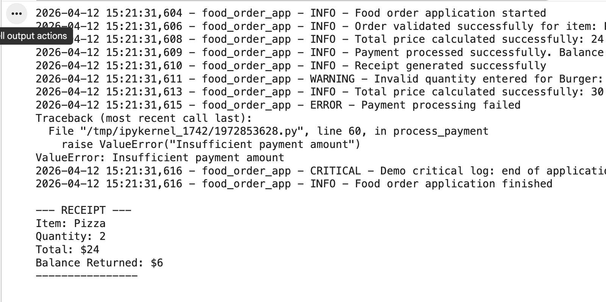
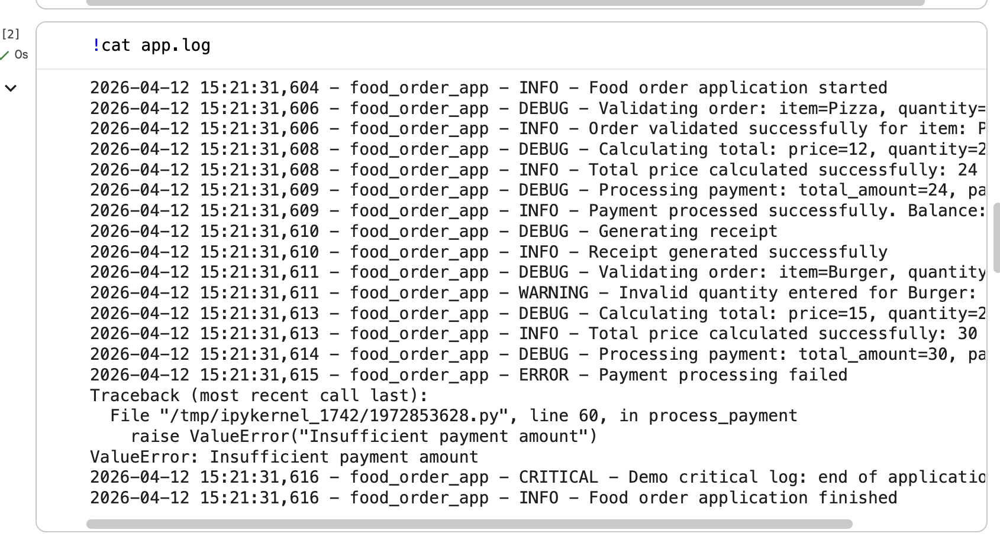
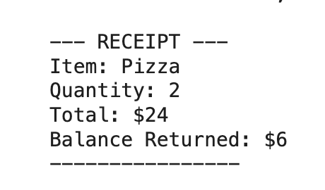

# 🍽️ Food Order Logging Lab

##  Overview
In this lab, I implemented a real-world inspired application using Python’s built-in `logging` library. Instead of using basic print statements, this project demonstrates how logging can be used to track application behavior, debug issues, and record important system events.

The application simulates a simple **Food Order Processing System** where an order is validated, processed, and logged at every step. This approach makes the system more structured, traceable, and maintainable.

---

##  Objectives
The key objectives of this lab are:

- Understand and implement Python logging
- Use different logging levels effectively:
  - `DEBUG`
  - `INFO`
  - `WARNING`
  - `ERROR`
  - `CRITICAL`
- Create and use a custom logger
- Log messages to both **console and file**
- Handle and log exceptions with traceback
- Build a meaningful application instead of a simple demo script

---

##  Implementation Details
I designed a **Food Order Processing Application** that performs the following operations:

1. Validates order inputs (item name and quantity)
2. Calculates total price based on quantity
3. Processes payment and handles insufficient balance
4. Generates a receipt for successful transactions
5. Logs all events including normal operations, warnings, and errors

This implementation is customized and not directly copied from the original lab examples.

---

##  Logging Concepts Demonstrated

| Log Level   | Purpose |
|------------|--------|
| DEBUG      | Tracks internal operations (calculations, validations) |
| INFO       | Confirms successful actions |
| WARNING    | Alerts invalid or unexpected inputs |
| ERROR      | Logs failures (e.g., payment failure) |
| CRITICAL   | Marks important system-level events |
| EXCEPTION  | Captures full traceback for debugging |

---

##  Project Structure
food_order_logging_lab/
├── app.py # Main Python application
├── app.log # Generated log file after execution
├── README.md # Documentation

##  Screenshots

### 🖥️ Console Output

---

### 📄 Log File Output

---

### 🧾 Receipt Output
 

### Key Learnings

Logging is more powerful than print statements
Helps track application flow step-by-step
Makes debugging easier with structured logs
Essential for real-world applications and production systems
Improves code maintainability and readability

Author: Rian Renold Dbritto
